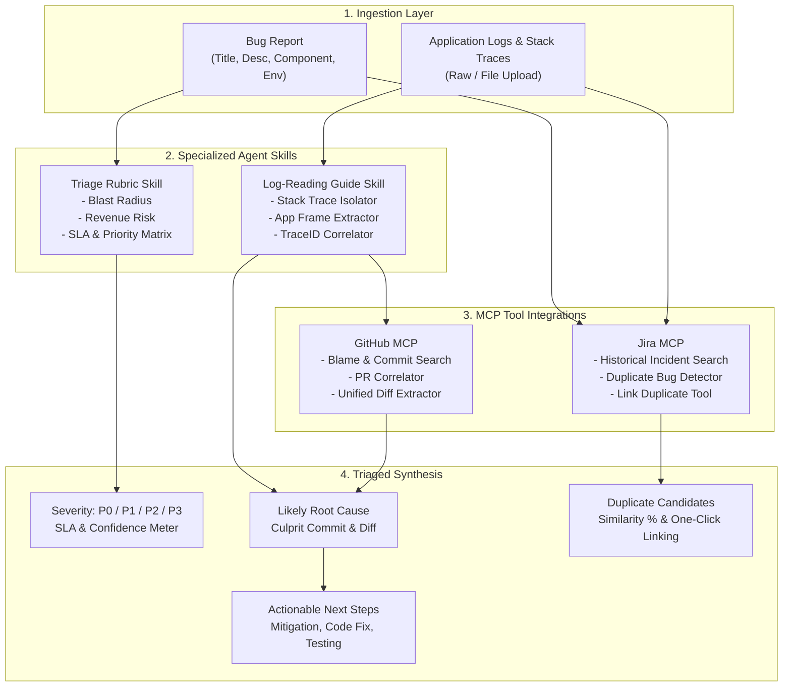

# 🛡️ SentinX — Autonomous Bug Analysis Agent

> **An Agentic Bug Triage & Root Cause Diagnosis System**  
> Ingests bug reports and raw server logs, applies incident triage rubrics and log-reading heuristics, connects to **Jira** and **GitHub** via Model Context Protocol (MCP), diagnoses the root cause with code diffs, recommends actionable next steps, and identifies duplicate bug tickets.

---

## 🚀 Key Features

- **📥 Dual Ingestion Layer**:
  - Structured bug reports: Summary, affected component, environment, version, description.
  - Raw server logs & stack traces: Live paste or `.log` / `.txt` / `.json` file uploader.
  - Pre-loaded enterprise scenarios (**P0** Payment NPE, **P1** Auth 401 Loop, **P2** Redis Saturation, **P3** UI theme flicker).

- **🧠 Specialized Agent Skills**:
  - **Triage Rubric Skill**: Automatically evaluates severity (**P0 Blocker**, **P1 High**, **P2 Medium**, **P3 Low**), SLA deadlines, priority level, blast radius, revenue impact, and customer workaround viability.
  - **Log-Reading Guide Skill**: Intelligently cleanses noise, isolates application stack frames from framework internals, extracts distributed `[TraceID]` identifiers, and detects error cascades.

- **🔌 Model Context Protocol (MCP) Tool Integrations**:
  - **Jira MCP**: Queries historical bug databases, retrieves past incident resolutions, and links related issues.
  - **GitHub MCP**: Scans recent commits and pull requests, correlates suspect files from the stack trace, and displays suspect code blame and unified git diffs.
  - **Stretch Goal — Duplicate Bug Detection**: Uses semantic text similarity and token overlap to discover duplicate tickets in Jira with match percentages and provides a 1-click **"Link as Duplicate"** workflow.

- **📊 Comprehensive Output Dashboard**:
  - **Severity & Impact Card**: Visual badge with glow, SLA countdown timer, and rubric decision breakdown.
  - **Likely Root Cause Diagnosis**: Plain-English explanation, deep technical details, culprit commit SHA, and syntax-highlighted regression diff.
  - **Sequential Remediation Playbook**: Categorized into *Immediate Mitigation*, *Permanent Code Fix*, *Reproduction & Unit Testing*, and *Observability & Alerting* with copyable commands.
  - **Evidence Inspector Tabs**: Multi-tab drawer to explore raw GitHub commits, historical Jira issues, and level-filtered log events (`ALL`, `ERROR`, `WARN`).

- **⚙️ Full Configuration UI**:
  - Configurable Jira MCP credentials (Host URL, Project Key, Token) with live API or enterprise mock database toggle.
  - Configurable GitHub MCP credentials (Repository, Branch, Personal Access Token).
  - Customizable Triage Rubric SLA hours, escalation keywords, and log-parsing app code prefixes.

---

## 🏗️ Architecture



---

## 📁 Repository Structure

```
├── src/
│   ├── components/
│   │   ├── Navbar.jsx             # Top branding, MCP connection status pills & config modal trigger
│   │   ├── BugInputPanel.jsx      # Ingestion forms, log editor, file uploader & run trigger
│   │   ├── TriageResultPanel.jsx  # Severity badges, root cause diff, duplicate detector & next steps
│   │   ├── EvidenceTabs.jsx       # Inspector tabs: GitHub commits, Jira records, parsed logs
│   │   └── ConfigModal.jsx        # Credentials modal for Jira, GitHub, and Rubric settings
│   ├── skills/
│   │   ├── triageRubric.js        # Severity matrices, SLA deadlines & scoring algorithms
│   │   └── logReader.js           # Multi-line log & stack trace parser with anomaly detection
│   ├── mcp/
│   │   ├── jiraMcp.js             # Jira MCP tool: bug search, duplicate detector, link actions
│   │   └── githubMcp.js           # GitHub MCP tool: commit history, blame, and unified diffs
│   ├── services/
│   │   └── agentEngine.js         # Master agent orchestrator synthesizing skills & MCP evidence
│   ├── data/
│   │   └── mockScenarios.js       # Pre-packaged production incident test scenarios
│   ├── App.jsx                    # Root state management & scenario switcher
│   ├── index.css                  # Custom design system with glassmorphic aesthetic & dark theme
│   └── main.jsx
├── test-agent.mjs                 # Automated CLI test suite for all agent scenarios
├── index.html
├── vite.config.js
└── package.json
```

---

## 🛠️ Quickstart & Local Setup

### Prerequisites
- [Node.js](https://nodejs.org/) (v18 or higher recommended)
- `npm` (v9 or higher)

### 1. Clone the Repository
```bash
git clone https://github.com/ajijshekh123/Bug-Analysis-Agent.git
cd Bug-Analysis-Agent
```

### 2. Install Dependencies
```bash
npm install
```

### 3. Run the Development Server
```bash
npm run dev
```
Open **`http://localhost:5173`** in your browser.

### 4. Run Automated CLI Verification Tests
To verify all triage scenarios directly in terminal without UI:
```bash
node test-agent.mjs
```

### 5. Build for Production
```bash
npm run build
```

---

## 🧪 Included Production Scenarios

1. **🚨 P0: Payment Gateway NullPointerException on Checkout**:
   - *Symptom*: Stripe 3D-Secure payments fail with HTTP 500; ~$14.2k/hr revenue impact.
   - *Diagnosis*: Unchecked null reference in `TaxCalculator.java:78` caused by recent PR #142 commit `e8f3b12`.
   - *Mitigation*: Immediate git revert of commit `e8f3b12` + null-safety patch.

2. **⚠️ P1: Auth Service 401 Loop with Clock Skew (Duplicate Bug Detection)**:
   - *Symptom*: Valid JWT tokens rejected across regions with 401 loops.
   - *Diagnosis*: `acceptLeeway(30)` removed in library upgrade commit `4b9101c`.
   - *Duplicate Match*: **AUTH-4082** (72% similarity match) with historical solution available and 1-click Jira linking.

3. **⚡ P2: Redis Connection Pool Exhaustion on Product Catalog**:
   - *Symptom*: Latency spike from 80ms to 4.2s under moderate evening load.
   - *Diagnosis*: Lettuce connection pool `max-active` lowered to 50 in `application-prod.yml`.

4. **🎨 P3: Dark Mode Theme Toggle Flicker**:
   - *Symptom*: Client-side hydration flash of unstyled content (FOUC).
   - *Diagnosis*: Theme script executing in `useEffect` rather than blocking document `<head>`.

---

## 📄 License
This project is licensed under the MIT License.
